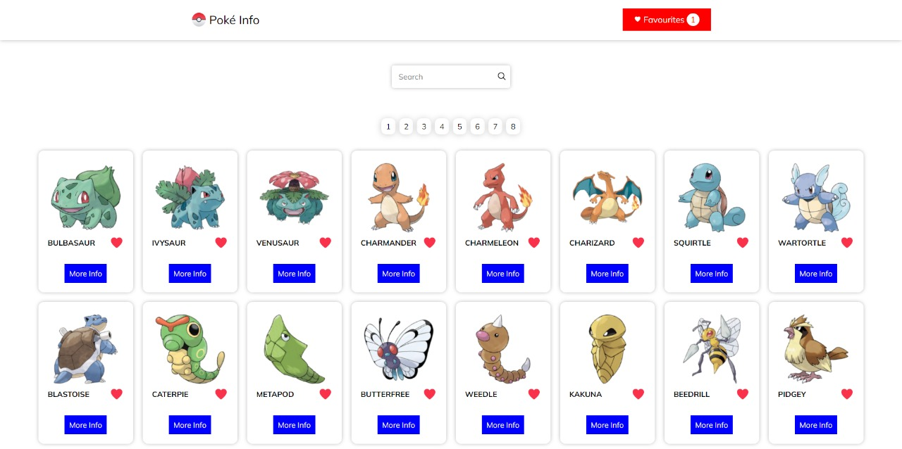
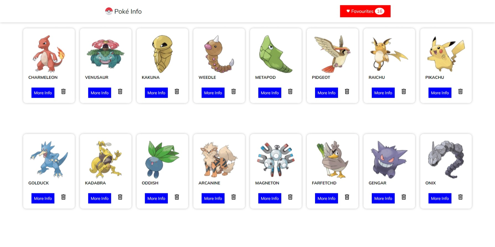
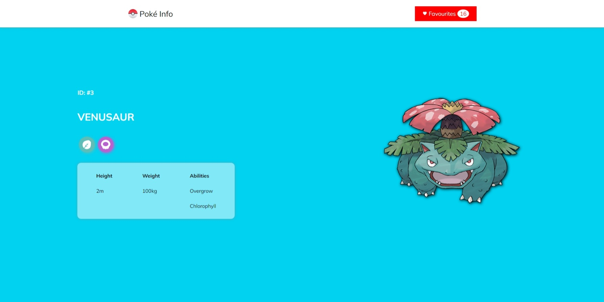

# Poké Info

A Pokemon information app built with React. Uses the [PokéAPI](https://pokeapi.co/) directly to fetch data on all Pokémons from every region.
[Live on Vercel](https://pokeinfo.vercel.app)

---

## Photos







---

## Running Locally

```bash
$ git clone https://github.com/rishikesh2003/Poke-Info.git

$ cd Poke-Info
$ npm install

$ npm start
```

---
